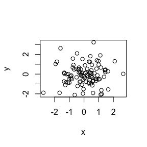

# Sept14

# Level 1 header

## This is my header

cmd-option-i to create chunks

This is a line of text. 

- bullet 1 
- bullet 2

## command option i 


```r
#this is a comment
x <- rnorm(100)
y <- rnorm(100)
plot(x,y)
```

<!-- -->


```r
summary(x)
```

```
##     Min.  1st Qu.   Median     Mean  3rd Qu.     Max. 
## -2.76600 -0.51300  0.10910  0.07368  0.66780  2.66900
```


## R Markdown

This is an R Markdown document. Markdown is a simple formatting syntax for authoring HTML, PDF, and MS Word documents. For more details on using R Markdown see <http://rmarkdown.rstudio.com>.

When you click the **Knit** button a document will be generated that includes both content as well as the output of any embedded R code chunks within the document. You can embed an R code chunk like this:


```r
summary(cars)
```

```
##      speed           dist       
##  Min.   : 4.0   Min.   :  2.00  
##  1st Qu.:12.0   1st Qu.: 26.00  
##  Median :15.0   Median : 36.00  
##  Mean   :15.4   Mean   : 42.98  
##  3rd Qu.:19.0   3rd Qu.: 56.00  
##  Max.   :25.0   Max.   :120.00
```

## Including Plots

You can also embed plots, for example:

<!-- -->

Note that the `echo = FALSE` parameter was added to the code chunk to prevent printing of the R code that generated the plot.
